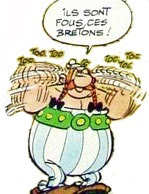
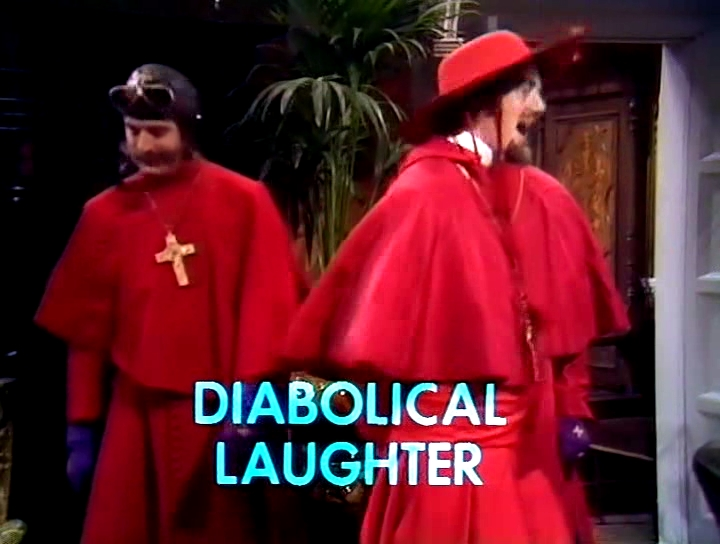

# Algebraic Data Types for fun and profit

---

# Algebraic

---

# Data

---

# Type

---

:::bigimage

:::

---

# Type

---

# de données

---

# algébrique

---

```java
class DnsRecord {
    String recordType;
    String domainName;
    String cnameAlias;
    IpAddr recordIp;
    int ttl;
}
```

---

```java
if(record.recordType.equals("CNAME")) {
    // should not be null
    record.cnameAlias;
} else if(record.recordType.equals("A")) {
    // should not be null
    record.recordIp;
} else {
    // ???
}
```

---

# Implicit subset of fields

---

# No Exhaustivity check

---

```java
switch() {
  //...
  case default:
    throw new RuntimeException(
      "This should not happen lol"
    );
}
```

---

# How can we make it better?

---

# Sum and Products

:::notes
| That's the meaning of algebraic
:::

---

# Product type

---

# Tuple?

---

# Record?

---

# Structure?

---

# Oh, right.

---

# POJO []{.make-alternate}

---

:::bigimage

:::

---

# Cardinality

:::notes
| as in "number of elements in a set"
| which assumes we view types as sets
| a way to gain intution, it does not hold all the way, since types can be infinite
:::

---

# `a * b`

---

# `(Bool * Bool)`

---

# `2 * 2 = 4`

---

# Sum type

---

# Enum

---

```
  NS |
  A |
  AAAA |
  CNAME |
  MX |
  TXT |
  SRV |
  SOA |
  PTR |
  CERT
```

:::notes
| do not confuse AAA (batteries)
| AAAA (ipv6 address record)
| AAAAA (andouillette)
:::

---

# Sum type

---

# `RecordType + Bool`

---

# `10 + 2 = 12`

---

# Sum type

---

```
      CnameRecord ( ttl, name, alias )
    | ARecord     ( ttl, name, ipv4 address )
    | AaaaRecord  ( ttl, name, ipv6 address )
    | TxtRecord   ( ttl, name, value )
    | ...
```

---

# Haskell

```haskell

data DnsRecord =
    CnameRecord Int String String
  | ARecord Int String IpV4
  | AaaaRecord Int String IpV6
  | TxtRecord Int String String
  | …
```

---

# Rust

```rust
enum DnsRecord {
  CnameRecord(u32, String, String),
  ARecord(u32, String, IpV4),
  AaaaRecord(u32, String, IpV6),
  TxtRecord(u32, String, String),
  …
}
```

---

# Let's factor it out

---

```
    DnsRecord( ttl, name,
        AValue(ipv4)
      | AaaaValue(ipv6)
      | CnameValue(alias)
      | TxtValue(name)
```

---

```rust
struct DnsRecord {
  name: String,
  ttl: u32,
  value: DnsRecordValue
}

enum DnsRecordValue {
  AValue(Ipv4),
  AaaaValue(Ipv6),
  CnameValue(String),
  TxtValue(String),
  …
}
```

---

# Distributivity

---

# `(a * b + a * c)`<br>`<=>`<br>`a * (b + c)`

---

# Commutativity

---

# `(a * b) <=> (b * a)`<br>`(a + b) <=> (b + a)`

---

# Identities

---

# `(a * 1) <=> a`<br>`(a + 0) <=> a`

---

# Unit type<br>(aka `()` aka `void`)

---

# `a * 1`

---

# `a + 1`

---

# Void type<br>(aka `!`, but not `void`!)

---

# `a + 0`

---

# `a * 0`

---

# Associativity

---

# <small>`(a + b) + c <=> a + (b + c)`<br>`(a * b) * c <=> a * (b * c)`</small>

---

# `a + b + c`<br>`a * b * c`

---

# Functions

---

# `a -> b`

---

# `b`<sup>`a`</sup>

---

# `c`<sup>`(a * b)`</sup>

---

# `(a, b) -> c`

---

# (`c`<sup>`b`</sup>)<sup>`a`</sup>

---

# `a -> b -> c`

---

# (`c`<sup>`b`</sup>)<sup>`a`</sup><br>`<=>`<br>`c`<sup>`(a * b)`</sup>

---

# `a -> b -> c`<br>`<=>`<br>`(a * b) -> c`

---

# #Currying

---

# Try other algebraic equivalences

---

# #intuition
